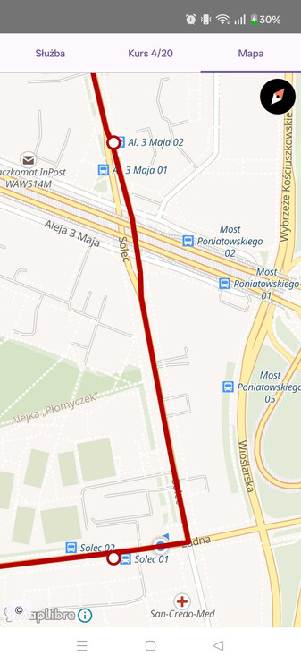

# Jak mam jechać

A navigation aid for Warsaw bus drivers: pick your line, brigade and day, and the map shows
the route you're driving — the next stretch between stops framed ahead of you, advancing
from one run to the next as you go.

## Źródła danych i licencje

### Dane rozkładowe

- [Zarząd Transportu Miejskiego w Warszawie](https://ztm.waw.pl)
- [GTFS: Mikołaj Kuranowski](https://mkuran.pl/gtfs/)
- [Kształty tras: © OpenStreetMap (ODbL)](https://www.openstreetmap.org/copyright)

### Mapa

- [© OpenMapTiles](https://www.openmaptiles.org/)
- [Dane © OpenStreetMap (ODbL)](https://www.openstreetmap.org/copyright)
- [OpenFreeMap](https://openfreemap.org)
